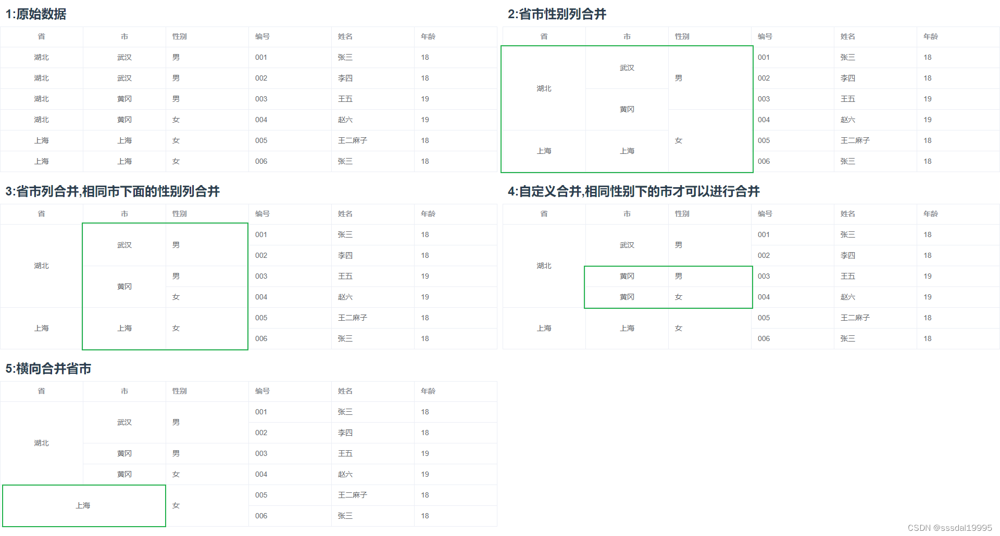

# cj-toolkit-x-table-merger
一个计算表格内数据合并的工具，支持行合并、列合并等常见场景。

## 配置项

 | 属性名 | 说明 | 类型 | 默认值 | 
 | ---- | ---- | ---- | ---- | 
 | mergeColumns | 纵向合并的列属性名 | Array<string> | [] | 
 | mergeColumnsRelations | 纵向合并的列关系 | Record<string,string> | [] | 
 | horizontalColumns | 横向合并的列属性名 | Array<string>/Array<Array<string>> | [] | 
 | disabled | 是否禁止内部计算,vue计算属性内可以通过此属性控制是否进行重新计算 | boolean/function | false | 
 | splitter | 分隔符,用于将行标识和列属性拼接为单元格id | string | '$$' | 
 | getRowKey | 获取当前行标识 | function | 取当前行上的id字段作为行标识 | 
 | mergeEmpty | 是否合并空字符串 和 undefined,设置自定义值比较规则后此属性失效 | boolean | false | 
 | judgeValueEquals | 自定义比较单元格的值,用于实现复杂业务逻辑,返回true 则合并 | function | 直接判断值是否相等 | 


### 使用方法
```typescript
import {TableCellMerger} from "cj-toolkit-x/table-merger"
// 创建一个单元格合并器
const tableCellMerger = new TableCellMerger()
// 定义options 配置项
const options:TableCellMergeOptions = {
}

const data = []
// 绑定配置项
tableCellMerger.setOptions(options)
// 执行计算合并
tableCellMerger.mergeCell(data)
// 获取合并信息
const rowData = {};// 需要获取合并属性的行
const prop = '';// 需要获取合并数据的属性
const cellMergeInfo = tableCellMerger.getCellMergeInfo(rowData,prop)
```
<font color="red">备注：以下场景均以vue3 element-plus 演示</font>
### 1.省市性别行合并:
```typescript
/* 省市性别行合并 */
// 构建一个表格合并计算器
const tableCellMerger1 = new TableCellMerger()
// 设置参数
tableCellMerger1.setOptions({
  mergeColumns: ['province', 'city', 'gender']
})
// 绑定数据
tableCellMerger1.mergeCell(data)
const spanMethod1 = function (params: { row: Record<string, any>, column: { property: string } }) {
  const {
    row,
    column
  } = params
  const { property } = column
  return tableCellMerger1.getCellMergeInfo(row, property)
}
```
### 2.省市合并,相同市下面的性别合并:
```typescript
/* 省市合并,相同市下面的性别合并 */
// 构建一个表格合并计算器
const tableCellMerger2 = new TableCellMerger()
// 设置参数
tableCellMerger2.setOptions({
  mergeColumns: ['province', 'city', 'gender'],
  mergeColumnsRelations: { gender: 'city' }
})
// 绑定数据
tableCellMerger2.mergeCell(data)
const spanMethod2 = function (params: { row: Record<string, any>, column: { property: string } }) {
  const {
    row,
    column
  } = params
  const { property } = column
  return tableCellMerger2.getCellMergeInfo(row, property)
}
```
### 3.自定义合并,相同性别下的市才可以进行合并：
```typescript
/* 自定义合并,相同性别下的市才可以进行合并 */
// 构建一个表格合并计算器
const tableCellMerger3 = new TableCellMerger()
// 设置参数
tableCellMerger3.setOptions({
  mergeColumns: ['province', 'city', 'gender'],
  mergeColumnsRelations: { gender: 'city' },
  judgeValueEquals (cur: CellValueWrapper, // 当前值
    next: CellValueWrapper, // 下一个值
    tableCellMerger: TableCellMerger, // 单元格合并管理器
    vertical: boolean): boolean {
    const { prop } = cur
    if (prop === 'city') {
      // 如果当前比较的市城市 那么先检查市
      if (next.rowData.gender !== cur.rowData.gender) {
        return false
      }
    }
    return !!tableCellMerger.defaultTableMergeOptions.judgeValueEquals?.(cur, next, tableCellMerger, vertical)
  }
})
// 绑定数据
tableCellMerger3.mergeCell(data)
const spanMethod3 = function (params: { row: Record<string, any>, column: { property: string } }) {
  const {
    row,
    column
  } = params
  const { property } = column
  return tableCellMerger3.getCellMergeInfo(row, property)
}
```

### 4.横向省市合并:
```typescript
/* 横向合并 */
// 构建一个表格合并计算器
const tableCellMerger4 = new TableCellMerger()
// 设置参数
tableCellMerger4.setOptions({
  mergeColumns: ['province', 'city', 'gender'],
  mergeColumnsRelations: { gender: 'city' },
  horizontalColumns: ['province', 'city'], // 横向合并省市
  judgeValueEquals (cur: CellValueWrapper, // 当前值
    next: CellValueWrapper, // 下一个值
    tableCellMerger: TableCellMerger, // 单元格合并管理器
    vertical: boolean): boolean {
    const { prop } = cur
    // 纵向合并
    if (prop === 'city') {
      // 如果当前比较的市城市 那么先检查市
      if (next.rowData.gender !== cur.rowData.gender) {
        return false
      }
    }
    return !!tableCellMerger.defaultTableMergeOptions.judgeValueEquals?.(cur, next, tableCellMerger, vertical)
  }
})
// 绑定数据
tableCellMerger4.mergeCell(data)
const spanMethod4 = function (params: { row: Record<string, any>, column: { property: string } }) {
  const {
    row,
    column
  } = params
  const { property } = column
  return tableCellMerger4.getCellMergeInfo(row, property)
}
```
demo代码地址:https://github.com/chenJJ20180912/cj-toolkit-x-demo/blob/master/src/views/table-cell-merger/index.vue
